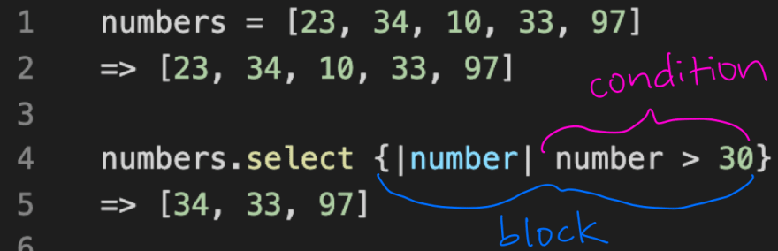

# ruby-enumerable-methods
Implementation of Basic Ruby enumerable methods using plain Ruby.

Additional description about the project and its features.

## Built With

- Ruby

## Getting Started

You can install rspec using the gem install commad: 
`$ gem install rspec`
and then you can run respec using:
`$ rspec`
## Authors

👤 **Author1**

- GitHub: [@omar-labana](https://github.com/omar-labana)
- Twitter: [@panda4cs](https://twitter.com/panda4cs)

👤 **Author2**

- GitHub: [@aduda-boaz](https://github.com/Aduda-Boaz)
- Twitter: [@BoazAduda](https://twitter.com/BoazAduda)

## 🤝 Contributing

Contributions, issues, and feature requests are welcome!

Feel free to check the [issues page](issues/).

## Show your support

Give a ⭐️ if you like this project!

## Acknowledgments

- Hat tip to anyone whose code was used
- Inspiration
- etc

## 📝 License

This project is [MIT](lic.url) licensed.
